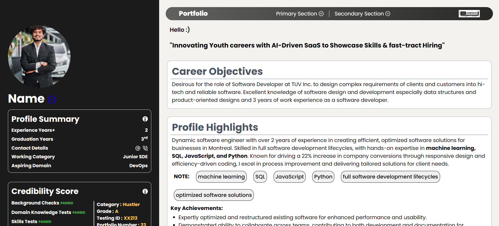

# Portfolio The Moronss

## Screenshots


## Table of Contents
- [Installation](#installation)
- [Usage](#usage)

## Installation
### Prerequisites
1. Node.js

### Steps
First, fork the repository and clone it.

```
https://github.com/<username>/Portfolio_TheMoronss.git
```

Install Dependencies
```
npm install
```

Run the development server:

```
npm run dev
```

## Usage
1. Run the application: 
```
npm run dev
```
2. Access the app: http://localhost:5173